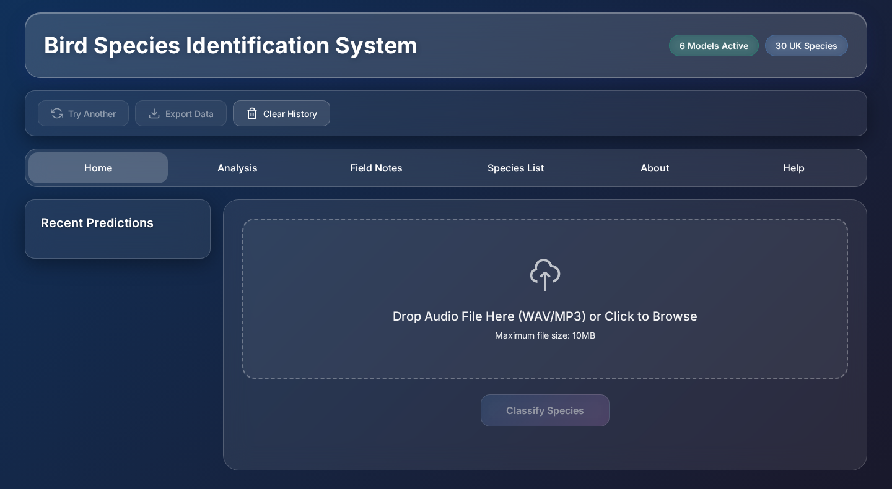

# Bird Species Identification from Audio

A deep learning system that identifies 30 UK bird species from audio recordings. Six independently trained models are combined into a weighted ensemble that reaches **97.28% accuracy** on a held-out test set. The project includes the full pipeline: audio preprocessing, model training, ensemble inference, a Flask API and a web interface.

Built as my MSc Computer Science dissertation at the University of Liverpool.



## Results

| Model | Test accuracy | Parameters |
|-------|--------------|------------|
| ResNet-50 + CBAM attention | 98.15% | 28.2M |
| ConvNeXt-Tiny | 96.52% | 27.8M |
| EfficientNet-B1 | 95.77% | 7.2M |
| PANNs CNN14 | 88.59% | 88.1M |
| DenseNet-121 | 86.33% | 8.0M |
| Audio Spectrogram Transformer | 85.60% | 10.9M |
| **Weighted ensemble** | **97.28%** | **170.2M** |

Each model's vote is weighted according to its measured accuracy, and the ensemble reports how many models agree on the prediction alongside the confidence score.

## How it works

```
audio file
   │
   ▼
preprocessing ── resample to 44.1 kHz mono
   │             split into 3 s segments with 50% overlap
   │             pre-emphasis filter (0.97)
   │             128-band mel spectrogram (300 Hz – 15 kHz), dB scale, normalised
   ▼
6 models ─────── EfficientNet-B1 · ResNet-50 CBAM · DenseNet-121
   │             AST · ConvNeXt-Tiny · PANNs CNN14
   ▼
ensemble ─────── weighted average / majority voting / stacking (configurable)
   ▼
species, scientific name, confidence, model agreement
```

## Repository layout

| Folder | Contents |
|--------|----------|
| `preprocessing/` | Converts raw recordings into memory-mapped spectrogram datasets for training |
| `training/` | One training script per model architecture |
| `ensemble/` | Model loading, ensemble strategies, inference and `configs/ensemble_config.yaml` |
| `backend/` | Flask API (`/api/classify`, `/api/health`) that runs the ensemble on uploaded audio |
| `frontend/` | Web interface: audio upload, spectrogram view, per-model predictions, agreement matrix and PDF report export |
| `tests/` | Ensemble tests and test-set evaluation |

## Tech stack

Python, PyTorch, torchaudio, librosa, timm, scikit-learn, Flask, JavaScript, Chart.js

## Species covered

Barn Owl, Black-headed Gull, Blackcap, Blue Tit, Bullfinch, Chaffinch, Chiffchaff, Coal Tit, Common Blackbird, Coot, Dunnock, Eurasian Magpie, Eurasian Wren, European Greenfinch, European Robin, Fieldfare, Goldcrest, Great Spotted Woodpecker, Great Tit, House Sparrow, Jackdaw, Long-tailed Tit, Mallard, Moorhen, Nuthatch, Pied Wagtail, Starling, Swallow, Tawny Owl, Water Rail

## Running it

The trained model weights (about 170M parameters in total) and the training dataset are not included in this repository because of their size. The source code for every stage is here, and the model and data paths are set in `ensemble/configs/ensemble_config.yaml`.

With the weights in place:

```bash
pip install -r requirements.txt

# Command-line identification
cd ensemble
python bird_identifier_fixed.py path/to/recording.wav

# Web interface
python backend/backend_direct.py      # API on http://localhost:5000
# then open frontend/index_final.html in a browser
```

### Reading the confidence score

| Confidence | Meaning |
|------------|---------|
| Above 70% | Strong identification with model consensus |
| 35% to 70% | Probable identification; check recording quality if unexpected |
| Below 35% | Likely an out-of-scope species or a poor recording |
